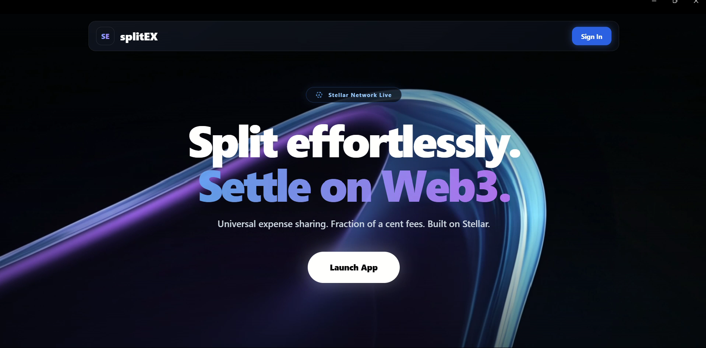

# SplitEX 🌐💸
**A Decentralized Web3 Bill Splitting Application built on the Stellar Blockchain!** 
SplitEX allows you to split bills, share expenses and settle payments trustlessly through Soroban Smart Contracts on Stellar.


---

## Live Demo
[SplitEX](https://split-ex-xi.vercel.app/)

## Demo Video
[Watch Full Demo on YouTube]()


## Contract Information
| Item | Value |
|------|-------|
| Network | Stellar Testnet |
| Contract ID | ` CAHORHFAW4MAIPWM4EDOWST3IP4MGPARHZ4EMXMUPYUBMAYO76JDDHAB ` |
| Deploy TX Hash | `eac32d86907d35820d153b3f0c8229cd5394b57ceb05a14f451adbd430f2a294` |
| Stellar Explorer | [View Contract](https://lab.stellar.org/smart-contracts/contract-explorer?$=network$id=testnet&label=Testnet&horizonUrl=https:////horizon-testnet.stellar.org&rpcUrl=https:////soroban-testnet.stellar.org&passphrase=Test%20SDF%20Network%20/;%20September%202015;&smartContracts$explorer$contractId=CAHORHFAW4MAIPWM4EDOWST3IP4MGPARHZ4EMXMUPYUBMAYO76JDDHAB;;) |


## Features
- Soroban Smart Contract escrow for trustless bill splitting
- Albedo & Freighter wallet integration
- Real-time balance display on Stellar testnet
- Transaction history with Stellar Explorer links
- Mobile-responsive UI
- Firebase-backed split group persistence

## Setup Instructions

### Prerequisites
- Make sure you have [Node.js](https://nodejs.org/) installed on your system.
- A Stellar wallet (Albedo or Freighter browser extension)

## ⚙️ How to Run Locally

You can easily run this interface on your own computer:

**Download the Code**: Clone or download this repository.
  

 **Start the App**: Open your terminal in the downloaded folder and run:

```bash
cd SplitEX
node server.js
```
Then open http://127.0.0.1:8080 in your browser.


## 📸 Screenshots

Here are some pictures of the application in action:

### Balance Displayed


### Wallet Options Available


### Mobile Responsive View

  - Babel Standalone — in-browser JSX transpilation (classic runtime)
  - Tailwind CSS (CDN / Play CDN)
  - Vanilla JS single-file app (app.js) served as static assets

 #  Backend / Hosting

  - Node.js built-in http module — lightweight static file server (server.js), runs on port 8080 (no external    
  dependencies)

  # Blockchain (Web3)

  - Stellar network (Testnet / Mainnet switchable)
  - Soroban smart contracts (on-chain escrow)
  - @stellar/stellar-sdk 13.3.0 — transaction building, simulation, RPC
  - Soroban RPC: https://soroban-testnet.stellar.org
  - Wallets: Freighter (stellar-freighter-api 1.5.1) and Albedo (@albedo-link/intent)

 # Smart Contract

  - Rust + Soroban SDK 22.0.0
  - Compiled to WASM (crate-type = ["cdylib", "rlib"])

  # Auth & Data

  - Firebase 10.8.1 — Authentication + Firestore (compat SDK)


